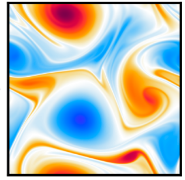
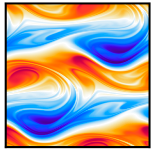

This repository is associated with our paper, ['Guided Unconditional and Conditional Generative Models for Super-Resolution and Inference of Quasi-Geostrophic Turbulence'](https://arxiv.org/abs/2507.00719). It contains the codes used for simulating the 2D quasi-geostrophic turbulence PDEs. We use a Fourier pseudo-spectral scheme with doubly periodic boundary conditions and time-step with a semi-implicit second-order Adams-Bashforth-Crank-Nicolson (AB2CN) scheme.

    


## Installation

Clone this repository. Then, create a virtual environment and install dependencies:
   ```bash
   python3 -m venv venv
   source venv/bin/activate
   pip install -r requirements.txt
   ```
---

## Usage

- Start from the `Driver` directory. Please change the directory names within according to your system or workflow. 
- The `Config` directory provides example configuration files with parameters for the simulations.

## Citing This Work

If you find this work interesting, please cite our paper, codes, or dataset:

```bibtex
@Article{suresh_babu_et_al_JAMES2025,
  author =	 {Suresh Babu, Anantha Narayanan and Sadam, Akhil and Lermusiaux,  Pierre F. J.},
  title =	 {Guided Unconditional and Conditional Generative Models for Super-Resolution and Inference of Quasi-Geostrophic Turbulence},
  journal =	 {Journal of Advances in Modeling Earth Systems},
  month = jul,
  year =	 2025,
  note =	 {Sub-judice},
  doi = {10.48550/arXiv.2507.00719}
}
```

```bibtex
@Misc{suresh_babu_et_al_2025a,
  author =	 {Suresh Babu, Anantha Narayanan and Sadam, Akhil and Lermusiaux, Pierre F. J.},
  title =	 {Guided Unconditional and Conditional Generative Models for Super-Resolution and Inference of Quasi-Geostrophic Turbulence [{D}ataset]},
  month =	 jun,
  year =	 2025,
  doi = {10.5281/zenodo.15742146},
  howpublished = {Zenodo}
}
```

```bibtex
@Misc{suresh_babu_et_al_2025b,
  author =	 {Suresh Babu, Anantha Narayanan and Sadam, Akhil and Lermusiaux, Pierre F. J.},
  title =	 {Guided Unconditional and Conditional Generative Models for Super-Resolution and Inference of Quasi-Geostrophic Turbulence [{S}oftware]},
  month =	 jun,
  year =	 2025,
  doi = {10.5281/zenodo.15750244},
  howpublished = {Zenodo}
}
```
---

## License

This project is licensed under the MIT License. See the `LICENSE` file for details.

---
